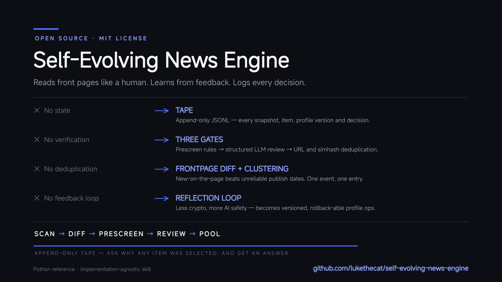

# Self-Evolving News Engine

> A news engine that evolves its own taste through explicit feedback and full lifecycle auditing.

Most "AI news" products today are just a prompt wrapped around a web search: stateless, unverified, full of duplicates, and deaf to feedback. They produce a summary, then forget everything.

This project is the opposite: a **deterministic, auditable, self-evolving news curation skill** built on four structural fixes:

| The problem | Our fix |
|-------------|---------|
| **No state** — every run starts from zero | **Tape** — an append-only JSONL log of every source snapshot, item, profile version, and decision |
| **No verification** — LLM hallucinates dates and sources | **Three gates** — prescreen rules, structured LLM review, and URL/simhash deduplication |
| **No deduplication** — the same event appears five times | **Frontpage diff + simhash clustering** — one event, one entry |
| **No feedback loop** — the same wrong filters run forever | **Reflection loop** — user feedback becomes versioned profile operations |

The result is a system you can interrogate: "Why was this item selected?" "When was this keyword added, and why?" The tape has the answer.



## Three differentiators

1. **Scan mode** — It reads sources like a human reads a newspaper front page: scan → diff → prescreen → review → pool. "New on the front page" is a more robust signal than parsing unreliable publish dates.
2. **Tape audit** — Every decision is recorded. Rejected items keep their `reject_reason`; that negative signal is the fuel for calibration.
3. **Reflection loop** — Feedback such as "more AI safety, fewer sponsored posts" is parsed into profile operations, versioned, logged, and validated against recent items.

## Architecture

```
┌─────────┐    ┌──────────┐    ┌─────────┐    ┌──────────┐
│ collect │ -> │   edit   │ -> │ review  │ -> │ publish  │
│ (scan)  │    │(prescreen│    │  (LLM)  │    │ (dedup + │
│         │    │  rules)  │    │         │    │  report) │
└─────────┘    └──────────┘    └─────────┘    └──────────┘
     │               │               │               │
     └───────────────┴───────────────┴───────────────┘
                         │
                    append-only TAPE
```

Read the full skill specification in [SKILL.md](SKILL.md). It is implementation-agnostic: you can run it with the included Python reference, with your own code, or directly as an LLM-agent pattern.

## Quick start

Requires Python 3.11+ (for `tomllib`; JSON configs work on earlier versions).

```bash
# Rule-only dry run (no LLM required)
python -m engine.pipeline --dry --vertical tech --config config/example_vertical.toml

# With LLM review
export SENE_LLM_API_KEY="sk-..."
python -m engine.pipeline --vertical tech --config config/example_vertical.toml
```

## How to use this repository

- **Want to understand the system?** Start with [SKILL.md](SKILL.md).
- **Want to run it?** Use the [engine/](engine/) reference implementation.
- **Want the design rationale?** Read [DESIGN.md](DESIGN.md).
- **Want to adapt it?** Copy [config/example_vertical.toml](config/example_vertical.toml) and edit sources, keywords, and negatives.

## Project structure

```
self-evolving-news-engine/
├── SKILL.md             # primary skill specification (start here)
├── README.md
├── LICENSE
├── DESIGN.md
├── engine/              # deterministic reference implementation
│   ├── tape.py
│   ├── profile.py
│   ├── feedback.py
│   ├── echo.py
│   ├── scanner.py
│   ├── prescreen.py
│   ├── verifier.py
│   ├── dedup.py
│   ├── report.py
│   └── pipeline.py
├── config/
│   └── example_vertical.toml
└── tests/
    └── test_smoke.py
```

## Tests

```bash
python -m pytest tests/test_smoke.py
```

All tests are offline.

## Acknowledgments

The append-only **tape** design is inspired by [bub](https://github.com/bubbuild/bub) —
a hook-first, tape-driven agent framework that records every decision in an
append-only log and reconstructs context from it.

## License

MIT
