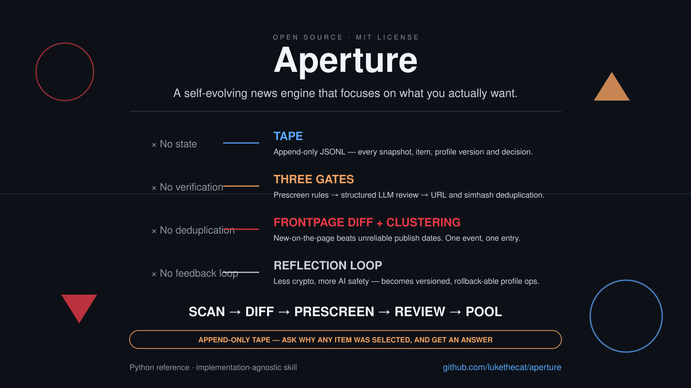

# Aperture



[](https://github.com/lukethecat/aperture/actions/workflows/ci.yml)

> A self-evolving news engine that focuses on what you actually want.

## The problem with AI news tools today

Most of them are **stateless prompt wrappers**: they search, summarize, and forget. The same stories reappear every day, the same event shows up five times across five feeds, and telling the tool "less crypto, more AI safety" changes nothing.

**Aperture is different.** It reads source front pages like a human, remembers everything in an append-only audit log, learns from your feedback, and can explain why any item was selected.

---

## What you get

| Without Aperture | With Aperture |
|------------------|---------------|
| Same headlines every day, duplicated across sources | One event, one entry — deduplicated by meaning |
| "Why did it pick this?" | A full tape record: scan → score → review → cluster |
| Static filters that drift | A versioned taste profile that evolves from your feedback |
| Needs an LLM API key to run | Rule-only dry mode works without any API key |

---

## Three ideas that matter

1. **Scan the front page** — Aperture diffs source front pages against yesterday, because "new on the front page" is a more robust signal than parsing unreliable publish dates.
2. **Tape everything** — Every source snapshot, item, rejection reason, profile version, and report is stored in append-only JSONL. Rejected items are not deleted; they are the fuel for calibration.
3. **Learn from feedback** — "More AI safety, fewer sponsored posts" becomes versioned profile operations. You can roll back any change and see what would have been filtered.

---

## Architecture

```
┌─────────┐    ┌──────────┐    ┌─────────┐    ┌──────────┐
│ collect │ -> │   edit   │ -> │ review  │ -> │ publish  │
│ (scan)  │    │(prescreen│    │  (LLM)  │    │ (dedup + │
│         │    │  rules)  │    │         │    │  report) │
└─────────┘    └──────────┘    └─────────┘    └──────────┘
     │               │               │               │
     └───────────────┴───────────────┴───────────────┘
                         │
                    append-only TAPE
```

Read the full skill specification in [SKILL.md](SKILL.md). It is implementation-agnostic: you can run it with the included Python reference, with your own code, or directly as an LLM-agent pattern.

---

## See a real issue

[docs/sample-issue.md](docs/sample-issue.md) shows a complete daily report where every item includes its tape decision chain: why it passed prescreen, what the LLM review said, and which cluster it belongs to.

---

## Quick start

Requires Python 3.11+ (for `tomllib`; JSON configs work on earlier versions).

```bash
# Clone the repo
git clone https://github.com/lukethecat/aperture.git
cd aperture

# Rule-only dry run (no LLM required)
python -m engine.pipeline --dry --vertical tech --config config/example_vertical.toml

# With LLM review
export SENE_LLM_API_KEY="sk-..."
python -m engine.pipeline --vertical tech --config config/example_vertical.toml
```

---

## Visual identity

Aperture uses a Kandinsky-inspired constructivist visual language: bold geometric forms, primary colors, and dynamic lines that echo the idea of focusing light through a lens. See [`assets/logo.svg`](assets/logo.svg), [`assets/banner.svg`](assets/banner.svg), [`assets/social-card.svg`](assets/social-card.svg), and [`assets/one-sheet.svg`](assets/one-sheet.svg).

---

## How to use this repository

- **Want to understand the system?** Start with [SKILL.md](SKILL.md).
- **Want module-by-module advantages?** See [docs/module-showcase.md](docs/module-showcase.md).
- **Want the design rationale?** Read [DESIGN.md](DESIGN.md).
- **Want to adapt it?** Copy [config/example_vertical.toml](config/example_vertical.toml) and edit sources, keywords, and negatives.
- **Curious why the name changed?** See [docs/naming-options.md](docs/naming-options.md).

---

## Project structure

```
aperture/
├── SKILL.md             # primary skill specification (start here)
├── README.md
├── LICENSE
├── DESIGN.md
├── CONTRIBUTING.md
├── assets/              # Kandinsky-style logos, banners, and social cards
│   ├── logo.svg
│   ├── banner.svg
│   ├── social-card.svg
│   └── one-sheet.svg
├── docs/                # deep-dive guides
│   ├── module-showcase.md
│   ├── sample-issue.md
│   ├── naming-options.md
│   ├── project-analysis-report.md
│   └── k3-analysis-brief.md
├── engine/              # deterministic reference implementation
│   ├── tape.py
│   ├── profile.py
│   ├── feedback.py
│   ├── echo.py
│   ├── scanner.py
│   ├── prescreen.py
│   ├── verifier.py
│   ├── dedup.py
│   ├── report.py
│   └── pipeline.py
├── config/
│   └── example_vertical.toml
├── .github/
│   ├── workflows/ci.yml
│   └── ISSUE_TEMPLATE/
└── tests/
    └── test_smoke.py
```

---

## Tests

```bash
python tests/test_smoke.py -v
```

All tests are offline.

---

## Acknowledgments

The append-only **tape** design is inspired by [bub](https://github.com/bubbuild/bub) —
a hook-first, tape-driven agent framework that records every decision in an
append-only log and reconstructs context from it.

---

## License

MIT
