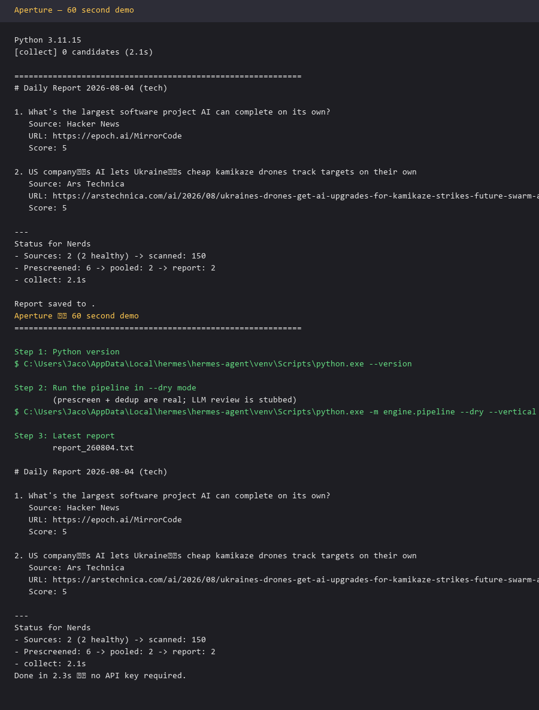

# Aperture


[](https://github.com/lukethecat/aperture/actions/workflows/ci.yml)

> A self-evolving news engine that reads front pages like a human — and can show you the tape for every decision it makes.

**Don't take our word for it.** [Read a real daily issue](docs/sample-issue.md) — every item carries its full decision chain: why it passed prescreen, what the review said, which cluster it landed in, and (for rejected items) exactly why it was cut.

---

## The problem with AI news tools today

Most of them are **stateless prompt wrappers**: they search, summarize, and forget. The same stories reappear every day, the same event shows up five times across five feeds, and telling the tool "less crypto, more AI safety" changes nothing.

Aperture is different: it remembers everything, learns from your feedback, and can explain itself.

---

## What you get

| Without Aperture | With Aperture |
|------------------|---------------|
| The same funding round summarized 5 times, across 5 feeds | One event, one entry — deduplicated by meaning |
| "Why did it pick this?" — no answer | A full tape record: scan → score → review → cluster |
| "Less crypto" — and tomorrow, more crypto | A versioned taste profile that actually evolves, and rolls back |
| A wall of notifications | ECHO: one-word questions, only when there's evidence |
| Needs an LLM API key to do anything | Rule-only dry mode runs with zero keys |

---

## Three ideas that matter

1. **Scan the front page, not the timestamp.** Aperture diffs each source's front page against yesterday's — because "new on the front page" is what an editor would notice, and it's a far more robust signal than the unreliable publish dates feeds give you.
2. **Tape everything.** Every source snapshot, item, rejection reason, profile version, and report goes into an append-only JSONL tape. Nothing is silently dropped: rejected items are fuel for calibration. Ask *"why was #14 cut?"* — the tape answers.
3. **Learn from feedback, reversibly.** "More AI safety, fewer sponsored posts" becomes versioned profile operations — not a re-prompt. Roll back any change and replay what would have been filtered.

**Plus:** Aperture is AI-native — [SKILL.md](SKILL.md) is the primary spec, executable directly as an LLM-agent pattern. See [`agent_runner.py`](agent_runner.py) for a working agent-orchestrated loop. And it degrades gracefully: `--dry` runs the whole pipeline on rules alone, no API key needed.

---

## How it works

```
┌─────────┐    ┌──────────┐    ┌─────────┐    ┌──────────┐
│ collect │ -> │   edit   │ -> │ review  │ -> │ publish  │
│ (scan)  │    │(prescreen│    │  (LLM)  │    │ (dedup + │
│         │    │  rules)  │    │         │    │  report) │
└─────────┘    └──────────┘    └─────────┘    └──────────┘
     │               │               │               │
     └───────────────┴───────────────┴───────────────┘
                         │
                    append-only TAPE
```

The spec in [SKILL.md](SKILL.md) is implementation-agnostic: run it with the included Python reference implementation, port it to your own stack, or hand it to an agent as-is.

---

## Quick start

Requires Python 3.11+ (for `tomllib`; JSON configs work on earlier versions).

```bash
git clone https://github.com/lukethecat/aperture.git
cd aperture

# Rule-only dry run — no LLM, no API key
python -m engine.pipeline --dry --vertical tech --config config/example_vertical.toml

# Full pipeline with LLM review
export APERTURE_LLM_API_KEY="sk-..."
python -m engine.pipeline --vertical tech --config config/example_vertical.toml
```

Tests are offline: `python tests/test_smoke.py -v`

---

## Try it in 60 seconds

No install, no API key — just Python:

```bash
python scripts/demo_60s.py
```



The script runs the pipeline in `--dry` mode, prints the latest daily report, and exits. Every decision it shows is also written to `tape/tech.jsonl`.

---

## Dig deeper

- **Understand the system** → [SKILL.md](SKILL.md) (start here)
- **Install as an agent skill** → [docs/installing-for-agents.md](docs/installing-for-agents.md)
- **See the evidence** → [docs/sample-issue.md](docs/sample-issue.md)
- **When is this the right tool?** → [docs/when-to-use-aperture.md](docs/when-to-use-aperture.md)
- **Module-by-module advantages** → [docs/module-showcase.md](docs/module-showcase.md)
- **Design rationale** → [DESIGN.md](DESIGN.md)
- **Replay any decision** → `python scripts/replay.py --item <id>`
- **Adapt it to your beat** → copy [config/example_vertical.toml](config/example_vertical.toml), edit sources, keywords, and negatives

<details>
<summary>Project structure</summary>

```
aperture/
├── SKILL.md                 # primary skill specification
├── agent_runner.py          # LLM-agent orchestration demo
├── scripts/
│   ├── demo_60s.py          # 60-second demo
│   ├── replay.py            # replay any item's decision chain
│   ├── harness_*.py         # harness tests for sample issue / demo / agent
│   └── render_demo_screenshot.py
├── DESIGN.md                # design rationale
├── engine/                  # deterministic reference implementation
├── config/                  # example vertical configs
├── assets/                  # logo, banner, social card, one-sheet, demo screenshot
├── docs/                    # deep dives, sample issue, install guides
└── tests/                   # offline smoke tests
```

</details>

---

## Acknowledgments

The append-only **tape** design is inspired by [bub](https://github.com/bubbuild/bub), a hook-first, tape-driven agent framework.

## License

MIT
